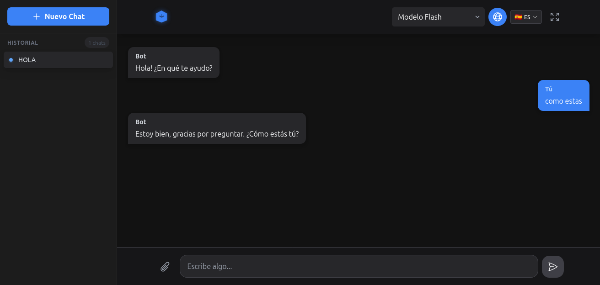

# Chatbot Vortex



Chatbot Vortex es una interfaz de chat para trabajar con varios proveedores de IA desde un solo lugar. El proyecto permite probar la experiencia en modo local, conectar proveedores con API key propia y exportar conversaciones desde el navegador.

## Demo

- Demo online: https://vortex-ia.netlify.app/
- Modo por defecto: `offline`
- Uso recomendado actual: demos, validacion de flujo y pruebas con BYOK

## Que ofrece

- Multiples proveedores en una sola UI: Gemini, Groq, OpenAI, DeepSeek, OpenRouter y modo local.
- Historial persistente en el navegador con exportacion a JSON y Markdown.
- Adjuntos con analisis basico de imagenes, PDFs, ZIPs, codigo, CSV, JSON, audio y video.
- Configuracion de modelo, temperatura, tokens maximos y prompt del sistema.
- Mejoras de accesibilidad: navegacion por teclado, mejor foco visual y menos movimiento si el sistema pide `prefers-reduced-motion`.
- Cancelacion de respuesta en curso y avisos visibles de estado o error.

## Stack

- React 19
- TypeScript
- Vite
- Tailwind CSS v4
- Lucide React

## Inicio rapido

Requisitos:

- Node.js 18 o superior

Instalacion:

```bash
git clone https://github.com/Victor00128/Chatbot-Vortex.git
cd Chatbot-Vortex
npm ci
npm run dev
```

Build de produccion:

```bash
npm run build
```

## Scripts disponibles

- `npm run dev`
- `npm run build`
- `npm run preview`

## Configuracion

La app arranca en `offline` por defecto. Eso evita exponer una clave preconfigurada y permite probar la interfaz sin tocar ninguna API.

Si quieres usar un proveedor real:

1. Abre el boton de ajustes.
2. Elige proveedor.
3. Pega tu API key.
4. Guarda y prueba conexion.

## Seguridad

La version actual funciona con API key propia. Cuando eliges un proveedor real, la clave se usa directamente desde el navegador.

Eso sirve para:

- demos
- uso personal
- validacion rapida del flujo

No es suficiente para:

- producto multiusuario
- ventas a empresas
- control real de cuotas, billing o abuse prevention

Si el proyecto evoluciona a una version comercial multiusuario, el siguiente paso logico es montar un backend o proxy que:

- reciba las peticiones del frontend
- proteja las claves
- aplique autenticacion, rate limits y observabilidad
- opcionalmente guarde historial fuera del navegador

## Estructura

```text
src/
├── components/
├── hooks/
├── types/
├── utils/
└── App.tsx
```

## Estado actual

Esta version deja el proyecto en un estado mucho mas solido para demo, revision tecnica e iteracion:

- configuracion segura por defecto
- interfaz mas consistente
- exportacion de datos
- accesibilidad basica mas solida
- manejo mas claro de errores y tiempos de espera

## Siguientes pasos recomendados

1. Sacar las llamadas a proveedores del frontend y moverlas a un backend.
2. Anadir autenticacion de usuarios y planes.
3. Guardar historial en base de datos o IndexedDB, no solo en `localStorage`.
4. Incorporar analitica, rate limiting y panel administrativo.
5. Preparar landing, pricing y una demo publica mas completa.

## Licencia

MIT. Ver el archivo [LICENSE](LICENSE).
